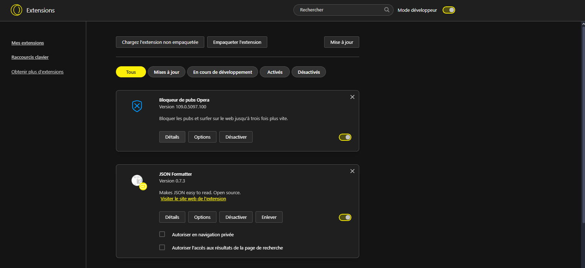

# ScreamBlock

## Description

ScreamBlock est un bloqueur de sites unique et effrayant. Lorsqu'un utilisateur tente d'accéder à un site bloqué, au lieu d'afficher une page d'erreur classique, ScreamBlock déclenche un screamer pour décourager les utilisateurs.

## Fonctionnalités

- **Blocage de sites** : Empêche l'accès à une liste prédéfinie de sites web.
- **Screamer** : Affiche un screamer chaque fois qu'un utilisateur essaie de visiter un site bloqué.
- **Audio** : Crie effrayant.
- **Personnalisation de la liste des sites bloqués** : Ajoutez ou retirez des sites de la liste de blocage.
- **Interface utilisateur simple** : Interface facile à utiliser pour gérer les paramètres de blocage.

## Installation

Pour ajouter l'extension :

1. Tout d'abord, récupérez le répertoire. Ouvrez votre terminal et exécutez la commande suivante :

    ```bash
    git clone "https://github.com/lionelpyt/ScreamBlock-Extension.git"
    ```

2. Ensuite, rendez-vous dans votre navigateur dans la partie extensions :

    

3. Enfin, cliquez sur "Chargez l'extension non empaquetée" et choisissez le chemin du répertoire que vous avez téléchargé précédemment.

Votre extension est maintenant prête à l'emploi. Il vous suffit simplement de l'épingler dans la barre d'outils.

## Utilisation de ScreamBlock

1. Quand vous cliquez sur ScreamBlock dans la barre d'outils, un menu apparaît.
2. Vous pouvez entrer l'URL du site que vous voulez bloquer.

### Fausse manipulation ou vous êtes bloqué sur la page et vous ne savez pas comment faire pour l'enlever ?

Pas de soucis ! Vous pouvez simplement supprimer le site bloqué dans ScreamBlock en cliquant sur la croix rouge dans la liste des sites bloqués.
