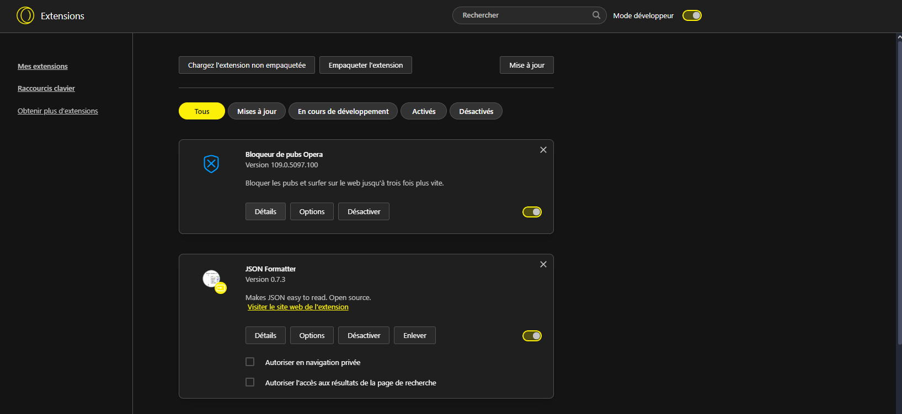

ScreamBlock

Description

ScreamBlock est un bloqueur de site unique et effrayant. Lorsqu'un utilisateur tente d'accéder à un site bloqué, au lieu d'afficher une page d'erreur classique, ScreamBlock déclenche un screamer pour décourager les utilisateurs.

Fonctionnalités

Blocage de sites : Empêche l'accès à une liste prédéfinie de sites web.
Screamer : Affiche un screamer chaque fois qu'un utilisateur essaie de visiter un site bloqué.
Audio : crie effrayant.
Personnalisation de la liste des sites bloqués : Ajoutez ou retirez des sites de la liste de blocage.
Interface utilisateur simple : Interface facile à utiliser pour gérer les paramètres de blocage.

Pour ajouter l'extension :

```
Tout dabord recuperer le repertoire :
 git clone "https://github.com/lionelpyt/ScreamBlock-Extension.git"
```
```
ensuite rendez-vous dans votre navigateur dans la partie extensions :


